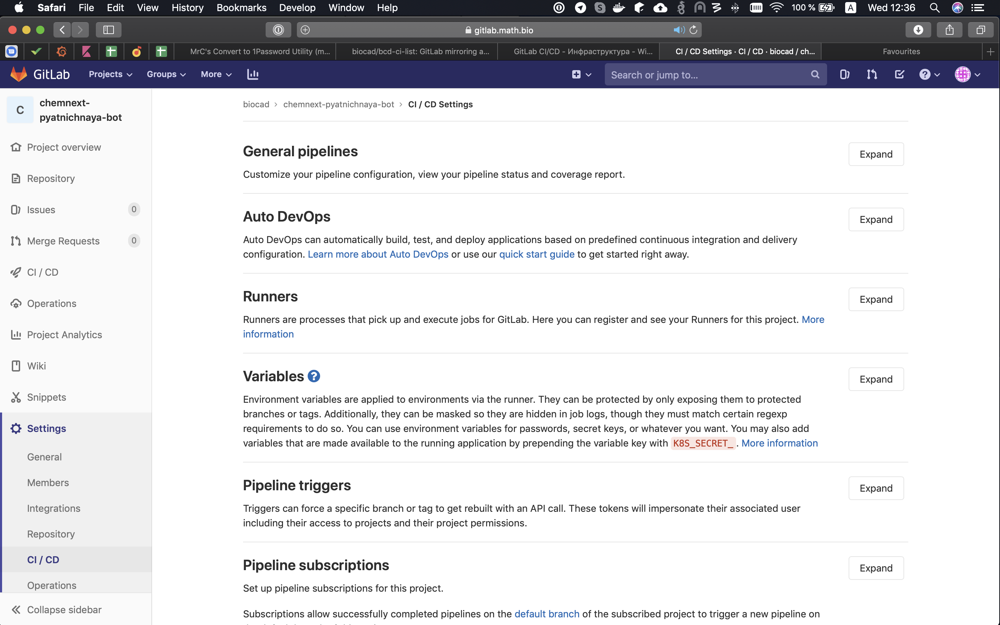
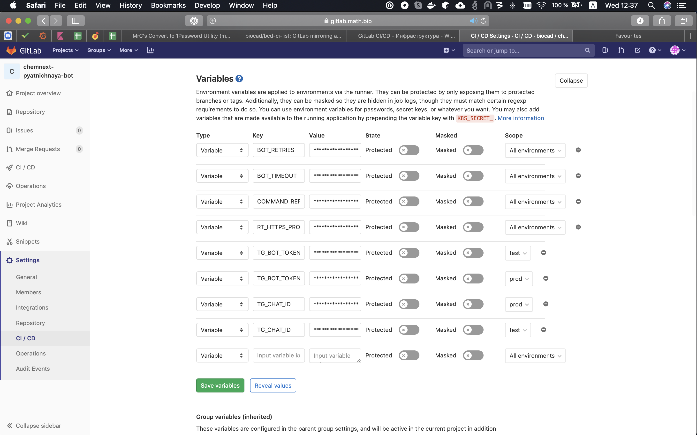

# Шаблонный репозиторий для ботов сбора обратной связи

В ДРИММ и ДВБ порой нужно собрать информацию с разных людей в одного человека. Например собрать презентации или файлики. Эти боты имеют примерно один код, и отличаются только welcome и help сообщениями, а также параметрами типа токена бота и куда слать сообщения.

Потому мы создали этот шаблон, чтобы решить проблему быстрого создания подобных ботов. Чтобы создать новго бота надо: 
1. Создать новый репо из этого шаблона
2. Настроить CI/CD [по инструкции с WIKI](https://wiki.math.bio/x/VAQnAg);
3. Попросить доступ в [гитлаб ДВБ](https://gitlab.math.bio) и права на этот репо там;
4. Проставить переменные кружения в гитлабе:
    1. `RT_HTTPS_PROXY` -- Получить прокси адрес от девопсов или разработчиков 
    2. `TG_BOT_TOKEN` -- токен бота можно получить у [@BotFather](http://t.me/BotFather)
    3. `TG_CHAT_ID` -- Чат, куда пересылать сообщения от пользователей. Можно добавить бота в группу или написать ему, а потом зайти по адресу http://api.telegram.org/botINSERT_TOKEN/getUpdates





Затем можно проставить тэг и бот полетит собираться. В целом все, это программа минимум для создания новго бота. Помимо этого можно:

- Обновить версию в [pyproject.toml](pyproject.toml)
- Написать свое приветствие и хэлп в [data/replies](data/replies/)
- Настроить, какие типы сообщений бот будет пересылать в [main.py](feedback_bot/main.py)

# Разработка

Чтобы запустить бота в режиме разработки надо выполнить следующее:

```console
$ poetry install
$ TG_BOT_TOKEN=INSERT_BOT_TOKEN TG_CHAT_ID=INSERT_CHAT_ID COMMAND_REPLIES_PATH=data/replies run_bot --dev
```
